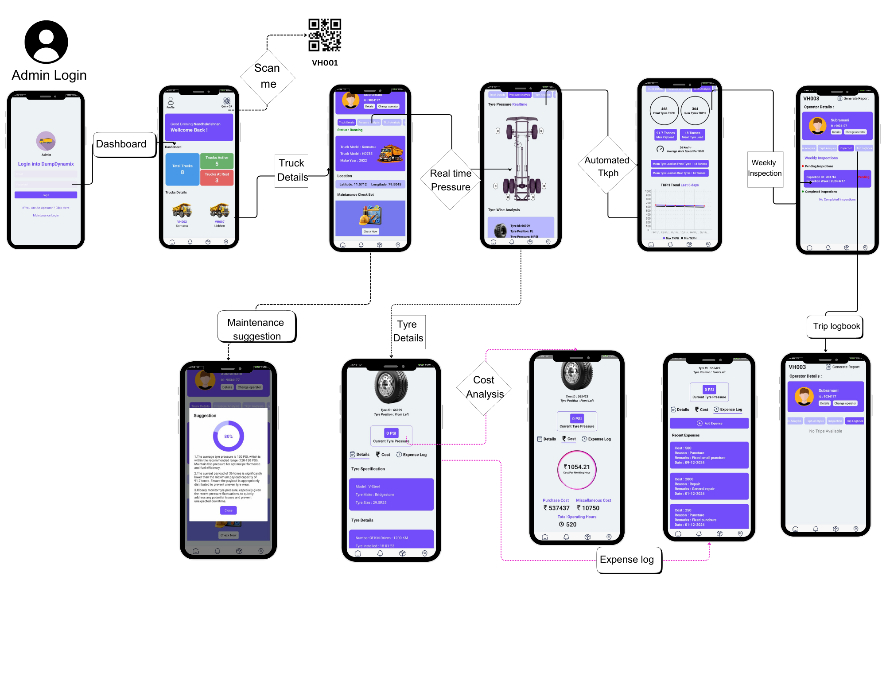

# DumpDynamix

DumpDynamix is a cross-platform mobile application built with React Native, complemented by a web-based dashboard. It is designed for real-time monitoring, maintenance, and management of truck tyres. The platform supports three types of user logins: Admin, Truck Operator, and Maintenance Team, each tailored to specific needs.

## Features

### Admin Features:
- Real-time Tyre Payload and Pressure Monitoring
- Real-time Notifications
- Report Generation
- TKPH (Ton Kilometer Per Hour) Estimation
- OQ-based Data Accessing
- Email-based Account Creation:
  - New accounts are created via email, with passwords and usernames sent directly to the users.
- Road Quality Map
- Tyre Inventory Management
- Cost per Working Hour Estimation
- Expense Manager

### Truck Operator Features:
- Multilingual Voice-based Alert System for essential updates.
- Track all the Parameters Collected
- Realtime Notification for Alerts 
### Dashboard:
- Web-based dashboard for drivers with real-time display of all critical parameters.

### Frontend:
- React.js-based admin platform with access to all admin features.

## Backend:
- Built with **Node.js** and **Express.js** using the MVC architecture.
- Database: **MongoDB**
- Integrated with:
  - **Cloudinary** for media management.
  - **Firebase** for notifications.
  - **Gemini 1.5 Pro** for advanced analytics.

## Technology Stack

- **Mobile App**: React Native
- **Frontend**: React.js
- **Backend**: Node.js, Express.js 
- **Database**: MongoDB
- **Integrations**:
  - Cloudinary
  - Firebase
  - Gemini 1.5 Pro

## Folder Structure

- `.vscode/` - Configuration files for development.
- `backend/` - Backend code using Node.js.
- `dashboard/` - Web-based dashboard for drivers.
- `dumpdynamix/` - Mobile application built with React Native.
- `frontend/` - Admin platform using React.js.
- `react-native.config.js` - React Native configuration file.
